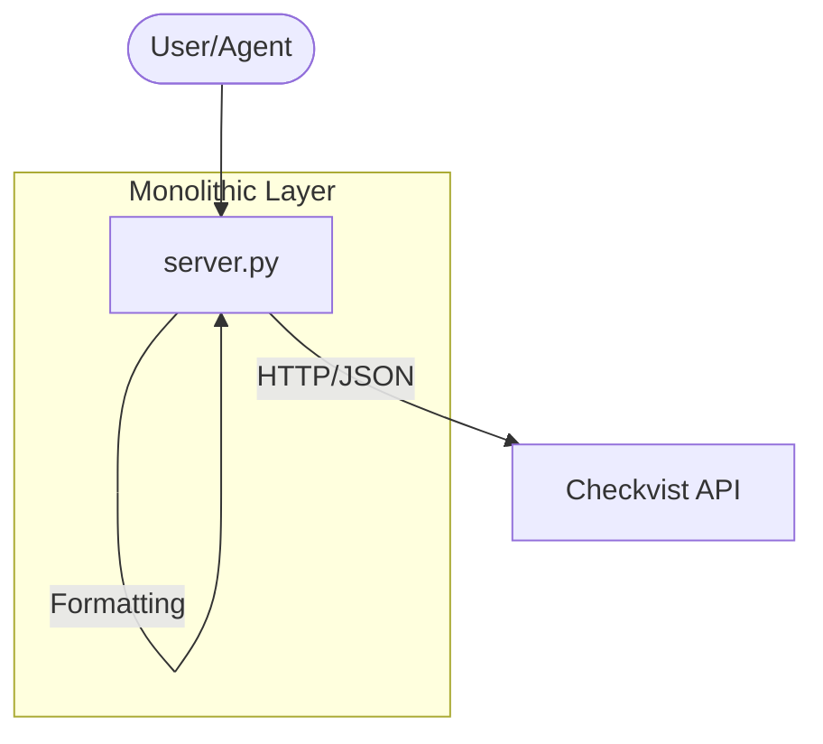
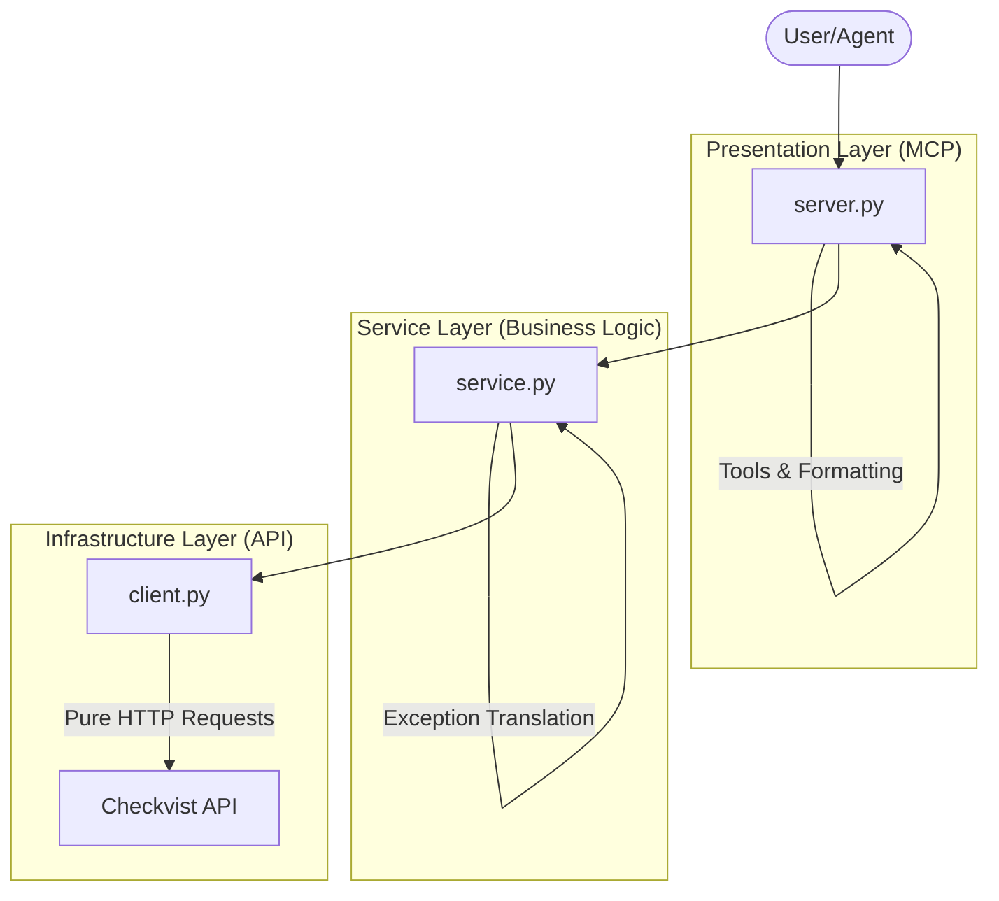

# Checkvist MCP Server: Architettura Visionaria & Tecnica

Questo documento è il punto di riferimento per lo sviluppo del server MCP. Unisce la visione strategica degli outliner moderni con una solida implementazione tecnica a strati.

## 1. Visione: Fondamenta della Struttura (The "Big Three")

| Fonte | Concetto | Applicazione Checkvist |
| :--- | :--- | :--- |
| **Notion** | Search-First | L'IA cerca sempre l'ID della lista/task per nome prima di operare. |
| **Obsidian** | Scrittura Atomica | Append veloce e gestione in Markdown per mantenere la leggibilità. |
| **ClickUp** | Metadati Ricchi | Uso intensivo di note e priorità per contestualizzare ogni task. |

## 2. Flusso di Lavoro Avanzato (Efficiency & NLP)

| Fonte | Concetto | Applicazione Checkvist |
| :--- | :--- | :--- |
| **Linear** | Triage Proattivo | Funzione di smistamento automatico dei nuovi task (Inbox Management). |
| **Todoist** | Smart Syntax | Inserimento tramite linguaggio naturale (`^domani #focus`). |
| **Logseq** | Proprietà Custom | Interpretazione di `chiave:: valore` all'interno del testo del task. |
| **Roam** | Serendipity | Ricerca di connessioni e riferimenti incrociati tra rami diversi. |

## 3. Livello Professionale (Advanced Automation)

| Fonte | Concetto | Applicazione Checkvist |
| :--- | :--- | :--- |
| **GitHub** | Cross-Referencing | Uso di ID e link per gestire le dipendenze ("Questo task blocca #123"). |
| **Readwise** | Resurfacing | L'IA ripropone vecchie idee o note per evitare che cadano nell'oblio. |
| **Superhuman** | Smart Snooze | Spostamento temporaneo di task non urgenti per pulire la vista attuale. |
| **Raycast** | Smart Macros | Template dinamici che iniettano variabili in strutture predefinite. |

---

## 4. Evoluzione Tecnica (Architectural Patterns)

Per supportare questa visione in modo scalabile e performante, il server si è evoluto da uno script monolitico a un'architettura a **Service Layer**.

### 4.1 AS-IS: Transaction Script (v1.x)
Inizialmente, tutta la logica di business e formattazione risiedeva direttamente nei tool MCP.

### 4.2 TO-BE: Service Layer Pattern (v2.x)
L'architettura attuale separa le responsabilità per ottimizzare le performance (N+1 queries) e la manutenibilità.

---

## 5. Specifiche Tecniche dei Tool MCP

### Gruppo: Navigazione (Core)
- `search(query)`: Ricerca globale testuale e semantica, ottimizzata tramite Service Layer per ridurre le chiamate API.
- `get_tree(id, depth)`: Esplora la gerarchia in modo controllato.
- `get_breadcrumbs(id)`: Ricostruisce il percorso (es. Progetti > AI > Server) usando la cache locale.

### Gruppo: Azione (Agentic)
- `smart_add(text, parent_id)`: Aggiunge task interpretando date e tag.
- `create_list(name, public)`: Crea una nuova checklist.
- `triage_inbox()`: Analizza la inbox e propone destinazioni.
- `apply_template(template_id, variables)`: Clona strutture predefinite.

### Gruppo: Manutenzione (Proactive)
- `resurface_ideas()`: Recupera task "stagnanti" per revisione via cache.
- `link_dependency(task_a, task_b)`: Crea un legame logico e visivo tra due compiti.
- `snooze(id, until)`: Nasconde o riprogramma task per ridurre il rumore.

---

## 6. Caching & Coerenza
- **Strategy**: Cache a 15 secondi per i metadati delle liste.
- **Invalidation**: Ogni scrittura invalida la cache locale per garantire dati freschi.